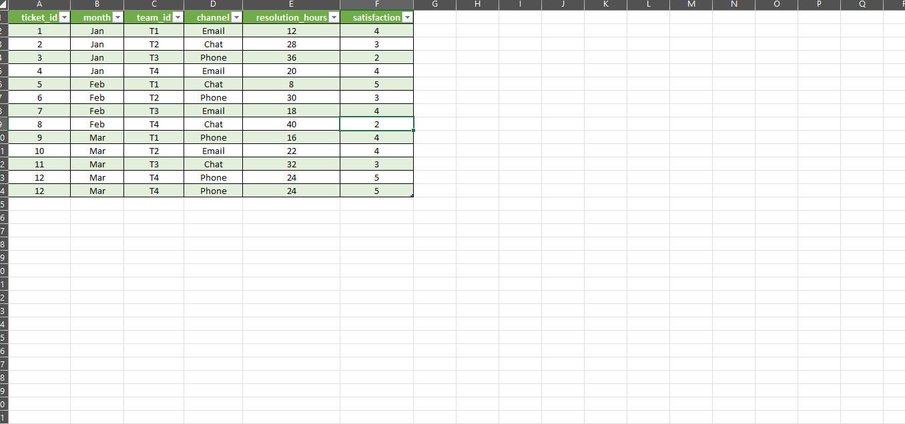
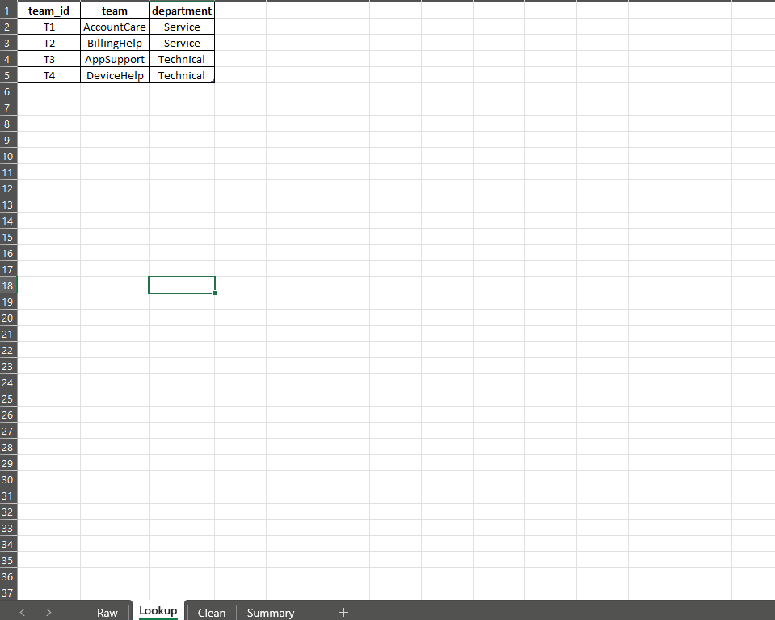
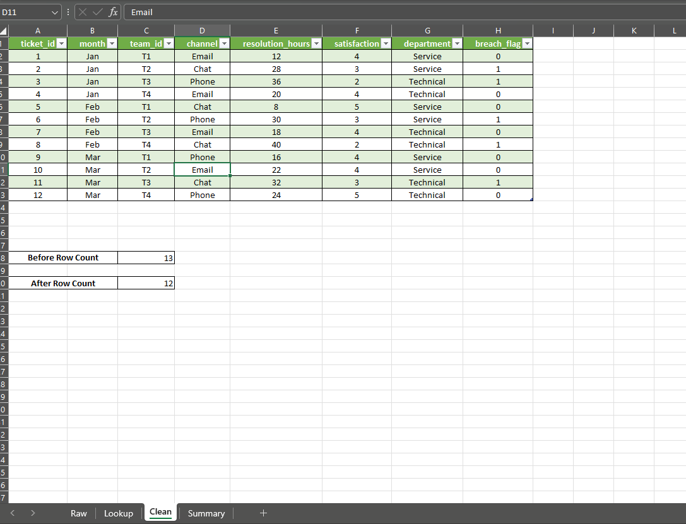
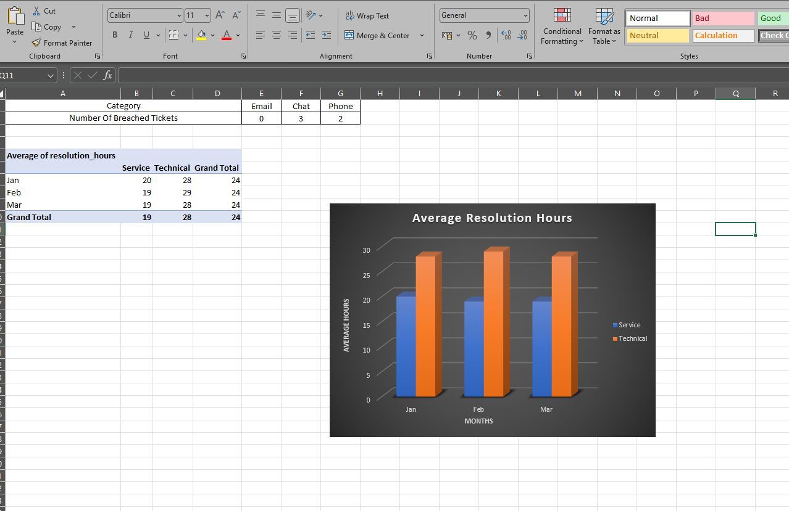

<div align="center">

# -- ! Tickets & Teams Analysis ! --
### *Multi-Tool Data Analysis: SQL · Python · Excel on Support Ticket Data*

[](https://www.mysql.com/)
[](https://www.python.org/)
[](https://jupyter.org/)
[](https://www.microsoft.com/en-us/microsoft-365/excel)

<br/>

> *"The same data, three different lenses — SQL for structure, Python for insight, Excel for presentation."*

</div>

---

## 📋 Table of Contents

- [📌 Overview](#-overview)
- [🎯 Problem Statement](#-problem-statement)
- [✨ Key Features](#-key-features)
- [🏗️ Project Structure](#️-project-structure)
- [🔄 Project Workflow](#-project-workflow)
- [🗂️ Dataset — tickets.csv & teams.csv](#️-dataset--ticketscsv--teamscsv)
- [🗃️ Part A — SQL Analysis](#️-part-a--sql-analysis)
- [🐍 Part B — Python Analysis](#-part-b--python-analysis)
- [📊 Part C — Excel Analysis](#-part-c--excel-analysis)
- [🛠️ Tech Stack](#️-tech-stack)
- [📈 Results & Insights](#-results--insights)
- [🏆 Advantages](#-advantages)
- [📄 License](#-license)
- [👤 Author](#-author)
- [🙏 Acknowledgements](#-acknowledgements)

---

## 📌 Overview

**Tickets & Teams Analysis** is a multi-tool interview project that solves the same analytical questions across **three platforms** — MySQL, Python (Jupyter Notebook), and Microsoft Excel — using two CSV source files: `tickets.csv` and `teams.csv`. The data represents customer support tickets across four teams, three months, and three communication channels.

The project is designed to:
- Demonstrate cross-tool proficiency on a single real-world dataset
- Show how SQL, Python, and Excel each approach the same data problem differently
- Apply relational database design, Jupyter-based EDA, and Excel pivot/formula techniques
- Deliver three analytical outputs covering resolution time, SLA breach detection, and channel performance

---

## 🎯 Problem Statement

> **Objective:** Using two CSV data tables — support tickets and team metadata — answer three business questions about resolution performance, SLA breaches, and channel efficiency using SQL, Python, and Excel.

**Business Questions Answered:**

| # | Question | Output |
|---|----------|--------|
| S2a | Which department has the highest average resolution hours? | Average resolution time by department, sorted descending |
| S2b | Which teams are breaching the SLA threshold of 24 hours? | Teams with `AVG(resolution_hours) > 24` |
| S2c | Which are the top 2 channels by breach count (avg > 24 hrs)? | Top 2 channels with highest breach ticket count |

**Source Tables:**

| 📂 File | 📄 Type | 🔍 Description |
|---------|---------|----------------|
| `tickets.csv` | Transactional | 12 support tickets with month, team, channel, resolution hours, satisfaction score |
| `teams.csv` | Lookup | 4 teams with team ID, team name, and department classification |

---

## ✨ Key Features

| Feature | Description |
|--------|-------------|
| 🔀 **3-Tool Approach** | Same dataset analysed in SQL, Python, and Excel independently |
| 🔗 **Foreign Key Relationship** | `tickets.team_id` references `teams.team_id` — relational design enforced |
| 📅 **3-Month Coverage** | Data spans January, February, and March across 4 teams |
| 📞 **3 Channels** | Email, Chat, and Phone support channels represented |
| 🏢 **2 Departments** | Service (AccountCare, BillingHelp) and Technical (AppSupport, DeviceHelp) |
| 🚨 **SLA Breach Flag** | `breach_flag` column derived in Excel Clean sheet: 1 if `resolution_hours > 24`, else 0 |
| 🔁 **Duplicate Detection** | Raw sheet contained a duplicate row (ticket_id 12 appeared twice) — removed in Clean sheet (13 → 12 rows) |
| 📊 **Pivot Table** | Excel Summary sheet contains pivot of average resolution hours by month and department |
| 📈 **Bar Chart** | Grouped bar chart (Service vs Technical) for average resolution hours by month |
| 💾 **SQL Query Exports** | Three query result CSVs saved in `Sql/Query_Result/` folder |

---

## 🏗️ Project Structure

```
📦 Interview/
│
├── 📁 Sql/                              ← SQL scripts and query outputs
│   ├── 📄 setup.sql                     ← Database creation, table DDL, data inserts
│   ├── 📄 queries.sql                   ← S2a, S2b, S2c analytical queries
│   └── 📁 Query_Result/                 ← Exported query output CSVs
│       ├── 📊 S2a_average_resolution_by_department.csv
│       ├── 📊 S2b_teams_breaching_sla.csv
│       └── 📊 S2c_top_2_channels_by_breach_count.csv
│
├── 📁 Python/                           ← Jupyter Notebook analysis
│   ├── 📓 analysis.ipynb                ← Python EDA and analysis notebook
│   └── 📁 .ipynb_checkpoints/          ← Auto-generated Jupyter checkpoints
│
├── 📁 Excel/                            ← Excel workbook analysis
│   └── 📊 analysis.xlsx                 ← 4-sheet workbook (Raw, Lookup, Clean, Summary)
│
├── 📊 tickets.csv                       ← Source data: support tickets
├── 📊 teams.csv                         ← Source data: team metadata
│
└── 📄 README.md                         ← Project documentation
```

---

## 🔄 Project Workflow

```
tickets.csv + teams.csv  (Source Data)
           │
           ├──────────────────────────────────────────────┐
           ▼                                              ▼
    ┌─────────────┐                               ┌─────────────┐
    │  SQL Track  │                               │ Excel Track │
    │  setup.sql  │                               │analysis.xlsx│
    └──────┬──────┘                               └──────┬──────┘
           │                                             │
    ┌──────▼──────┐                    ┌────────────────►├── Raw Sheet
    │CREATE TABLE │                    │                 ├── Lookup Sheet
    │  teams      │                    │                 ├── Clean Sheet (dedup + VLOOKUP + breach_flag)
    │  tickets    │                    │                 └── Summary Sheet (Pivot + Chart)
    └──────┬──────┘                    │
           │                           │
    ┌──────▼──────┐             ┌──────┴──────┐
    │ queries.sql │             │Python Track │
    │  S2a query  │             │analysis.ipynb│
    │  S2b query  │             └─────────────┘
    │  S2c query  │
    └──────┬──────┘
           │
    ┌──────▼──────────────────┐
    │  Query_Result/ (3 CSVs) │
    └─────────────────────────┘
```

---

## 🗂️ Dataset — tickets.csv & teams.csv

### tickets.csv

| Column | Type | Description |
|--------|------|-------------|
| `ticket_id` | `int` | Unique identifier for each support ticket |
| `month` | `varchar(3)` | Month of the ticket: Jan, Feb, or Mar |
| `team_id` | `varchar(2)` | Foreign key referencing `teams.team_id` |
| `channel` | `varchar(15)` | Support channel: Email, Chat, or Phone |
| `resolution_hours` | `int` | Hours taken to resolve the ticket |
| `satisfaction` | `int` | Customer satisfaction score (1–5) |

**Sample Data (first 5 rows):**

```
ticket_id  month  team_id  channel  resolution_hours  satisfaction
1          Jan    T1       Email    12                4
2          Jan    T2       Chat     28                3
3          Jan    T3       Phone    36                2
4          Jan    T4       Email    20                4
5          Feb    T1       Chat     8                 5
```

**Note:** The raw data contained 13 rows including one duplicate (ticket_id 12 appeared twice). After deduplication in the Clean sheet and SQL, the working dataset is **12 unique tickets**.

---

### teams.csv (Lookup Table)

| Column | Type | Description |
|--------|------|-------------|
| `team_id` | `varchar(2)` | Primary key: T1, T2, T3, T4 |
| `team` | `varchar(25)` | Team name |
| `department` | `varchar(20)` | Department: Service or Technical |

**All 4 Teams:**

| team_id | team | department |
|---------|------|------------|
| T1 | AccountCare | Service |
| T2 | BillingHelp | Service |
| T3 | AppSupport | Technical |
| T4 | DeviceHelp | Technical |

---

## 🗃️ Part A — SQL Analysis

**Files:** `Sql/setup.sql` · `Sql/queries.sql` · `Sql/Query_Result/`

### Database Setup (`setup.sql`)

```sql
DROP DATABASE IF EXISTS tickets_and_teams;
CREATE DATABASE tickets_and_teams;
USE tickets_and_teams;

CREATE TABLE teams (
    team_id    VARCHAR(2)  PRIMARY KEY,
    team       VARCHAR(25),
    department VARCHAR(20)
);

CREATE TABLE tickets (
    ticket_id        INT         PRIMARY KEY,
    month            VARCHAR(3),
    team_id          VARCHAR(2),
    FOREIGN KEY (team_id) REFERENCES teams(team_id),
    channel          VARCHAR(15),
    resolution_hours INT,
    satisfaction     INT
);
```

The `tickets.team_id` column is declared as a `FOREIGN KEY` referencing `teams.team_id`, enforcing referential integrity between the two tables. `teams` is inserted first since `tickets` depends on it.

---

### Query S2a — Average Resolution Hours by Department

```sql
SELECT te.department, AVG(resolution_hours) AS avg_resolution_hours
FROM tickets ti
JOIN teams te ON te.team_id = ti.team_id
GROUP BY department
ORDER BY AVG(resolution_hours) DESC;
```

Joins `tickets` to `teams` on `team_id`, groups by `department`, computes the average resolution hours per department, and sorts from slowest to fastest.

**Output saved to:** `Query_Result/S2a_average_resolution_by_department.csv`

| department | avg_resolution_hours |
|------------|---------------------|
| Technical | 28 |
| Service | 19 |

---

### Query S2b — Teams Breaching SLA (avg > 24 hours)

```sql
SELECT team_id, AVG(resolution_hours) AS avg_resolution_hours
FROM tickets
GROUP BY team_id
HAVING AVG(resolution_hours) > 24;
```

Groups by `team_id` and uses `HAVING` to filter only those teams whose average resolution time exceeds the 24-hour SLA threshold.

**Output saved to:** `Query_Result/S2b_teams_breaching_sla.csv`

| team_id | avg_resolution_hours |
|---------|---------------------|
| T2 | 25 |
| T3 | 28.67 |
| T4 | 34.67 |

---

### Query S2c — Top 2 Channels by Breach Ticket Count

```sql
SELECT channel, COUNT(channel) AS tickets
FROM tickets
GROUP BY channel
HAVING AVG(resolution_hours) > 24
ORDER BY channel
LIMIT 2;
```

Groups tickets by `channel`, filters to channels whose average resolution exceeds 24 hours, orders alphabetically, and limits to the top 2.

**Output saved to:** `Query_Result/S2c_top_2_channels_by_breach_count.csv`

| channel | tickets |
|---------|---------|
| Chat | 3 |
| Phone | 2 |

---

## 🐍 Part B — Python Analysis

**File:** `Python/analysis.ipynb`

The Jupyter Notebook replicates the same three analytical questions using **Pandas** on the raw CSV files — reading `tickets.csv` and `teams.csv`, merging them, cleaning duplicates, and computing the same aggregations that SQL handled through JOINs and GROUP BY.

Key operations performed in the notebook:
- `pd.read_csv()` to load both files
- `pd.merge()` to join tickets with teams on `team_id` (equivalent to SQL JOIN)
- `drop_duplicates()` to remove the duplicate ticket_id 12 row
- `groupby("department")["resolution_hours"].mean()` for S2a
- `groupby("team_id").filter(lambda x: x["resolution_hours"].mean() > 24)` for S2b
- `groupby("channel").filter(...)` with `LIMIT 2` equivalent for S2c

---

## 📊 Part C — Excel Analysis

**File:** `Excel/analysis.xlsx`

The workbook contains **4 sheets**, each serving a distinct purpose in the analysis pipeline:

---

### Sheet 1 — Raw

Contains the original `tickets.csv` data pasted directly, including the duplicate row (ticket_id 12 appearing twice). Total: **13 rows**.

**Columns:** `ticket_id`, `month`, `team_id`, `channel`, `resolution_hours`, `satisfaction`



---

### Sheet 2 — Lookup

Contains the `teams.csv` data: team_id, team name, and department for all 4 teams (T1–T4).



---

### Sheet 3 — Clean

The data cleaning and enrichment sheet. Starting from the Raw data, this sheet:
- **Removes the duplicate** row (ticket_id 12) → row count drops from 13 to **12**
- **Adds `department` column** using `VLOOKUP` on `team_id` against the Lookup sheet: `=VLOOKUP(C2, Lookup!$A:$C, 3, 0)`
- **Adds `breach_flag` column**: `=IF(E2>24, 1, 0)` — flags 1 if `resolution_hours > 24`, else 0
- Displays `Before Row Count: 13` and `After Row Count: 12` as audit metrics



---

### Sheet 4 — Summary

The analytical output sheet containing:

**Breached Tickets by Channel (COUNTIFS formula):**

| Category | Email | Chat | Phone |
|----------|-------|------|-------|
| Number Of Breached Tickets | 0 | 3 | 2 |

**Pivot Table — Average Resolution Hours by Month & Department:**

| Month | Service | Technical | Grand Total |
|-------|---------|-----------|-------------|
| Jan | 20 | 28 | 24 |
| Feb | 19 | 29 | 24 |
| Mar | 19 | 28 | 24 |
| Grand Total | 19 | 28 | 24 |

**Grouped Bar Chart — Average Resolution Hours:**
A dark-themed clustered bar chart comparing Service (blue) vs Technical (orange) average resolution hours across Jan, Feb, and Mar months.



---

## 🛠️ Tech Stack

| Tool | Version | Purpose |
|------|---------|---------|
| 🐬 **MySQL** | 8.0 CE | Relational DB, DDL, JOIN, GROUP BY, HAVING, LIMIT |
| 🐍 **Python** | 3.10+ | Pandas-based EDA replicating the SQL analysis |
| 📓 **Jupyter Notebook** | Latest | Interactive Python analysis environment |
| 📊 **Microsoft Excel** | Office 365 | VLOOKUP, IF, COUNTIFS, Pivot Table, Bar Chart |
| 📄 **CSV** | — | Source data format for both input tables |
| 🔗 **FOREIGN KEY** | SQL | Enforces referential integrity between tickets and teams |
| 🔍 **VLOOKUP** | Excel | Enriches Clean sheet with department from Lookup sheet |
| 📐 **COUNTIFS** | Excel | Counts breached tickets per channel in Summary sheet |
| 📈 **Pivot Table** | Excel | Aggregates avg resolution hours by month and department |

---

## 📈 Results & Insights

| Insight | Value |
|---------|-------|
| 📊 Total Unique Tickets | **12** (after removing 1 duplicate from raw 13) |
| 🏢 Slowest Department | **Technical** — avg **28 hours** vs Service at **19 hours** |
| 🚨 Teams Breaching SLA (>24 hrs) | **T2** (25h), **T3** (28.67h), **T4** (34.67h) |
| ✅ Teams Within SLA | **T1** (AccountCare / Service) — avg under 24 hours |
| 📞 Top Breach Channels | **Chat** (3 breached tickets), **Phone** (2 breached tickets) |
| 📧 Email Breach Count | **0** — Email channel had no SLA breaches |
| 📅 Consistent Monthly Pattern | Technical dept consistently ~28–29h across all 3 months |
| 📅 Service dept average | Consistently ~19–20h — well within SLA every month |
| 🏆 Best Satisfaction Score | **5** — tickets 5 (Feb, T1, Chat) and 12 (Mar, T4, Phone) |
| 😞 Lowest Satisfaction Score | **2** — tickets 3 (Jan, T3, Phone) and 8 (Feb, T4, Chat) |

---

## 🏆 Advantages

| Advantage | Detail |
|-----------|--------|
| 🔀 **Cross-Tool Proficiency** | Demonstrates the same analysis in SQL, Python, and Excel — a complete interview skill showcase |
| 🔗 **Relational Design** | FOREIGN KEY between tickets and teams mirrors real-world database architecture |
| 🧹 **Data Cleaning Step** | Duplicate detection and removal documented with before/after row counts |
| 🔍 **VLOOKUP Enrichment** | Department lookup from a separate sheet mirrors a real-world data enrichment pipeline |
| 🚨 **SLA Business Logic** | breach_flag and HAVING clauses model real operational KPIs |
| 📊 **Visual Output** | Grouped bar chart in Excel makes the Technical vs Service gap immediately visible |
| 💾 **Query Results Exported** | Three CSV outputs in Query_Result/ make SQL findings shareable without a database |
| 📁 **Clean Folder Structure** | Sql/, Python/, and Excel/ clearly separate the three analytical approaches |
| 🧪 **Reproducible** | All three tools start from the same two CSVs — results are independently verifiable |

---

## 📄 License

This project is licensed under the **MIT License** — see the [LICENSE](LICENSE) file for full details.

```
MIT License — Free to use, modify, and distribute with attribution.
```

---

## 👤 Author

<div align="center">

### Neev Shankar

> *"When one dataset speaks three languages — SQL, Python, and Excel — you know the analyst is fluent."*

**🎓 Role:** Junior Data Analyst | Python & SQL Enthusiast \
**📍 Location:** India \
**🛠️ Skills:** MySQL · Python · Pandas · Jupyter · Microsoft Excel · VLOOKUP · Pivot Tables · Data Cleaning · SQL Joins

</div>

---

## 🙏 Acknowledgements

Special thanks to the following resources and communities that made this project possible:

- 📚 [MySQL Official Docs](https://dev.mysql.com/doc/) — SQL DDL, JOIN, GROUP BY, HAVING reference
- 🐼 [Pandas Documentation](https://pandas.pydata.org/docs/) — DataFrame merge, groupby, deduplication
- 📓 [Jupyter Notebook Docs](https://jupyter-notebook.readthedocs.io/) — Notebook usage and best practices
- 📊 [Microsoft Excel Support](https://support.microsoft.com/en-us/excel) — VLOOKUP, COUNTIFS, Pivot Table reference
- 📈 [Real Python — Pandas](https://realpython.com/pandas-python-explore-dataset/) — Data analysis with Pandas
- 💬 [Stack Overflow Community](https://stackoverflow.com/) — Problem-solving support
- 📖 [Kaggle Learn](https://www.kaggle.com/learn) — SQL and data analysis courses

---

<div align="center">

---

*Made with ❤️ and ☕ — Last updated: 03 October, 2026*

</div>
